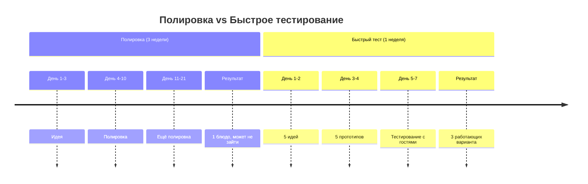

# Запусти несколько вариантов. Не ждите идеала

> **Пиллар:** ⚙️ Операционка
> **Адаптировано из:** идея Аяза про быстрое тестирование вместо полировки

## История

Видел, как новый повар месяц полировал 1 рецепт суши. Вроде идеально, но гостям оказалось скучно. Параллельно другой повар запустил 5 вариантов за неделю. Три из них гости сразу полюбили.

## Принцип

Вместо идеала — скорость. Запусти несколько вариантов параллельно, посмотри какой покупают гости, его расширяй. Остальное закрывай.

На кухне это выглядит так:
- **День 1–2:** придумываешь 5 новых роллов (не идеалов)
- **День 3–4:** готовишь их в небольших количествах
- **День 5–7:** гости пробуют → видишь какой берут
- **Неделя 2:** развиваешь топ-2 варианта, убиваешь остальное

## Результаты

Быстрое тестирование даёт две вещи:
1. Понимаешь что работает (не угадываешь)
2. Экономишь время (неудачные варианты быстро убрал)

## Вопрос

Сколько новых блюд вы тестировали в прошлом месяце?

---

## Визуал

**Концепция:** две временные шкалы (слева — полировка 3 недели, справа — тест 5 вариантов за неделю) + результаты разные.

**Mermaid:**

