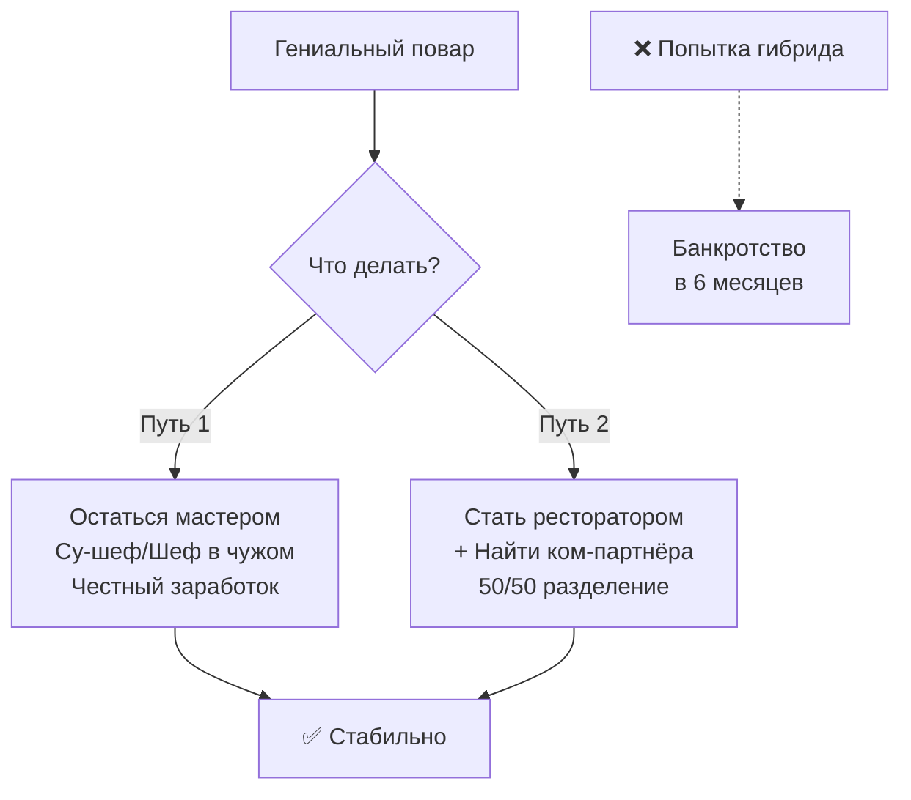

# Повар ≠ Ресторатор. Почему гении на кухне часто разоряют свой бизнес

> **Пиллар:** 📖 Кейсы и личное
> **Адаптировано из:** идея Гребенюка про производственника и коммерсанта

---

## Хук

Не каждый мастер может быть владельцем. Два разных навыка. Гениальный повар может быть дилетантом в расчётах, деньгах, найме.

## История (реальный опыт)

Сам прошёл через это. Когда открывал доставку суши с нуля, первые месяцы думал: «Если я будут готовить, то гости сами придут. Качество сделает своё.» 

Блюда были хорошие. Но:
- Не считал фудкост правильно — расходов оказалось больше, чем ожидал
- Сам стоял на кухне, не мог уходить. Первая же смена без меня — хаос
- Не знал как продавать. Ждал гостей вместо того, чтобы делать акции, искать каналы
- За первый месяц потратил 400 тыс, заработал 150. Неделька-две такого темпа — и всё.

Спас только то, что я не был **только** повар. Смог переключиться на управление, нанять людей, выстроить процесс. И тогда доставка взлетела.

Когда потом открывал филиалы в Острогожске, Семилуках, Рамони — уже знал: туда нужен управляющий, который считает деньги. Я даю ему проверенную систему, он её запускает. Я следующий филиал открываю.

## Вывод

Есть два пути:
1. **Остаться мастером** — стать су-шефом в чужом ресторане, где о деньгах думает кто-то другой. И честно зарабатывать.
2. **Стать ресторатором** — найти партнёра, который умеет управлять и считать деньги. Ты — кухня. Он — зал, маркетинг, бухгалтерия.

Гибрид не работает. Выбери одно.

## Вопрос

Вы знаете повара, который открыл свой и что случилось?

---

## Визуал

**Концепция:** два пути (стрелка 1 вверх «мастер в чужом ресторане» vs стрелка 2 вверх «партнёрство повар+управленец»).

**Форма:** схема или инфографика.

**Mermaid:**

**ТЗ для Canva:**
- Две стрелки вверх (пути)
- Их названия и что входит (должности, навыки)
- Красная стрелка вниз — гибрид → банкротство
- Зелёная галка — итог обоих путей
