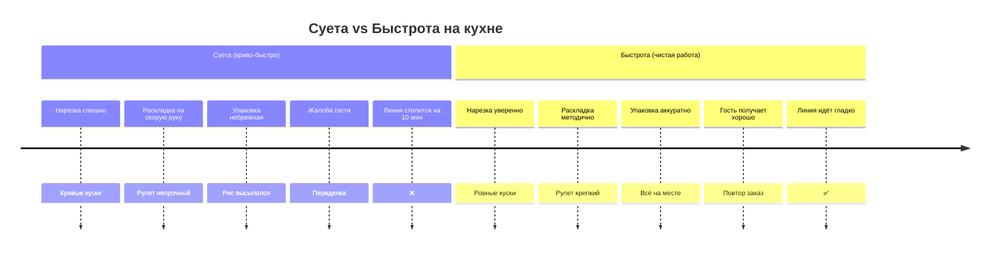

# Быстрота vs Суета на кухне. Почему криво-быстро — это медленно

> **Пиллар:** ⚙️ Операционка
> **Адаптировано из:** идея Гребенюка про точность вместо спешки

---

## Хук

Шум на кухне часто выглядит как активность. На самом деле это потеря времени. Медленно и чисто будет быстрее, чем быстро и криво.

## История

Час-пик. Линия забита заказами. Два сценария:

**Сценарий 1 (Суета):**
- Повар нарезает рыбу наспех — кривые куски.
- Су-шеф спешит раскладывать — рулет не плотный.
- Упаковка на скорую руку — рис высыпался.
- Результат: гость получает холодный, разваливающийся ролл → жалоба → переделка → линия тормозит на 10 минут.

**Сценарий 2 (Быстрота):**
- Повар режет уверенно, куски ровные (видит это каждый день).
- Су-шеф раскладывает ровно — рулет плотный с первого раза.
- Упаковка чистая — ничего не высыпается.
- Результат: все 15 роллов вышли хорошо → гости довольны → линия идёт без сбоев.

Быстрота + точность = в итоге быстрее. Суета + ошибки = переделки = медленнее.

## Вывод

Дай команде время научиться правильно. Потом скорость будет сама собой.

## Вопрос

На вашей кухне сейчас суета или быстрота?

---

## Визуал

**Концепция:** две временные шкалы (Timeline): суета (видна переделка) vs быстрота (гладко).

**Форма:** инфографика или схема.

**Mermaid:**

**ТЗ для Canva:**
- Две колонки: слева — суета (красная), справа — быстрота (зелёная)
- По центру — временные затраты (суета дольше)
- Иконки (нож, рулет, упаковка, часы)
